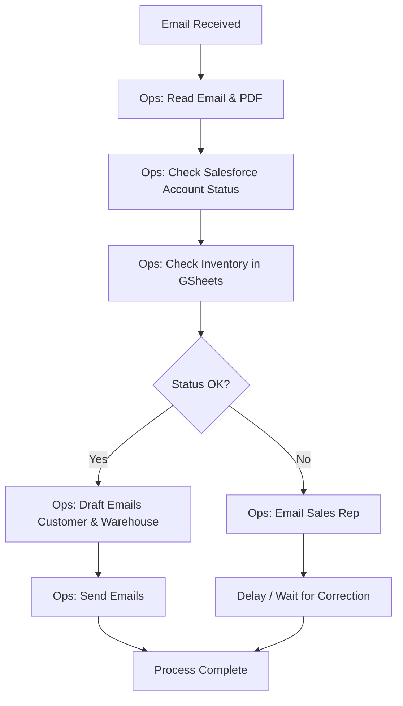
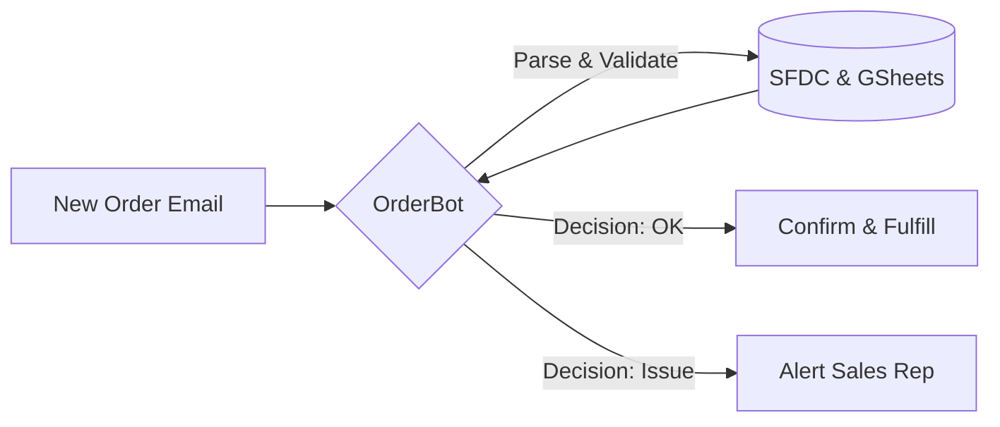

# OrderBot Retrieval & Automation Proposal

---

## Slide 1: The Problem: Our Current Order Process Is a Bottleneck

**Current Situation:**
Our highly manual process for handling hardware orders is slowing us down and introducing risk.

**Manual Workflow:**

**Key Pain Points:**
*   **Manual Data Entry**: Ops team spends hours reading PDFs and typing data.
*   **System Switching**: Constant context switching between Email, Salesforce, and Google Sheets.
*   **Bottlenecks**: Dependency on human availability causes delays, especially during spikes.
*   **Error Risk**: Fatigue leads to mistakes in inventory checks and data entry.

---

## Slide 2: The Solution: Introducing 'OrderBot', Our Autonomous AI Agent

**What is OrderBot?**
An intelligent agent designed to autonomously handle the entire order lifecycle, functioning as a 24/7 digital team member.

**Automated Workflow:**

**How It Works:**
1.  **Perceives**: Instantly detects emails and extracts data from PDF order forms.
2.  **Validates**: Checks Salesforce for account status and Google Sheets for real-time inventory.
3.  **Decides**: Applies business logic to approve orders or flag exceptions.
4.  **Acts**: Updates systems and sends confirmation emails automatically.

---

## Slide 3: The Business Impact & Recommended Next Steps

**Tangible Benefits:**
*   **Speed**: Processing time reduced from ~30 mins to **< 5 minutes**.
*   **Accuracy**: Target accuracy of **99.5%** with standardized validation.
*   **Availability**: 24/7 processing, eliminating weekend/overnight backlogs.
*   **Staff Focus**: Frees up Ops team to focus on complex customer issues and strategic improvements.

**Recommended Next Step: Low-Risk Proof of Concept (POC)**
We propose a **"Read-Only" Shadow Mode** for 2 weeks:
*   **Goal**: Validate OrderBot's accuracy without risk.
*   **How**: OrderBot will process live orders in the background and log its "decisions" *without* sending emails or updating real data.
*   **Review**: We will compare OrderBot's logs against the Ops team's actual actions to verify performance before full rollout.
